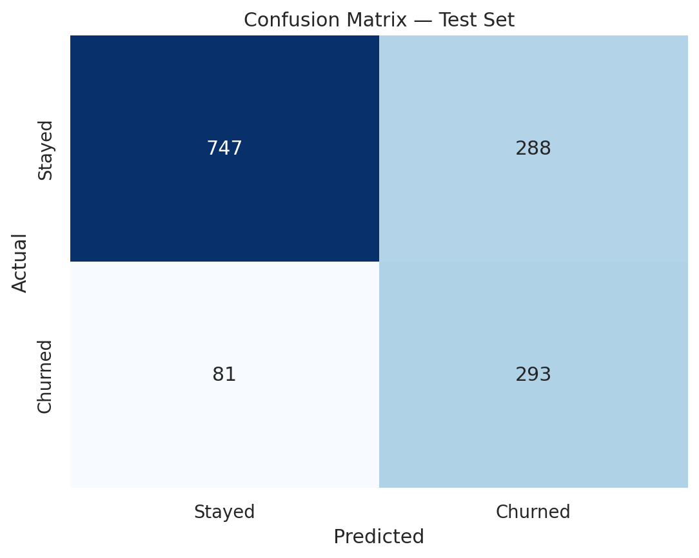
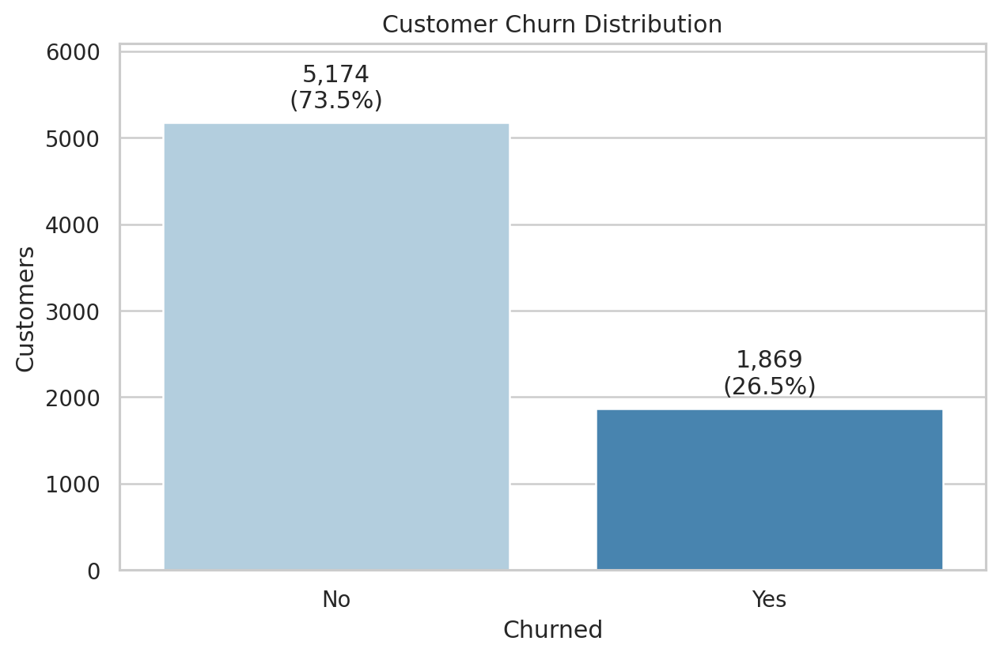
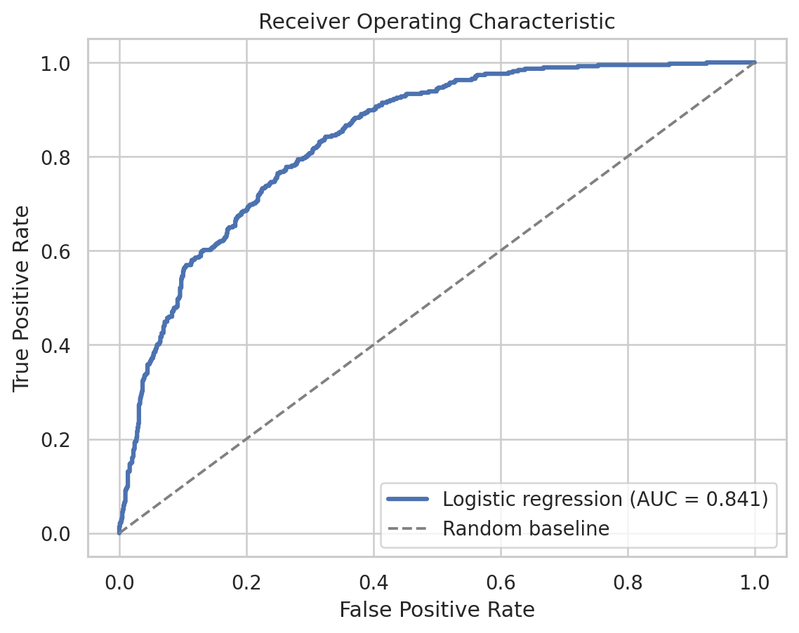
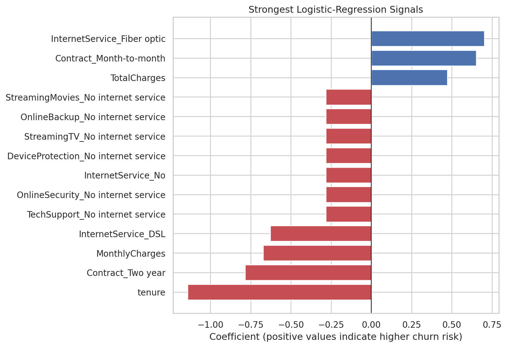

# Customer Churn Machine-Learning Pipeline

[](https://github.com/HazimAli07/customer-churn-ml-pipeline/actions/workflows/tests.yml)

An end-to-end classification project that identifies telecom customers at risk
of leaving. The project uses a reproducible scikit-learn pipeline to clean
mixed data, prevent preprocessing leakage, train a logistic-regression model,
and evaluate performance with business-relevant metrics.

## Business Goal

Customer retention teams cannot contact every subscriber. A churn-risk model
can help prioritize customers for proactive service, support, or retention
offers. Because failing to identify a true churner can be expensive, this
project deliberately gives **recall** more importance than raw accuracy.

## Verified Results

The final model was evaluated on a stratified 20% holdout set containing 1,409
customers.

| Metric | Result |
| --- | ---: |
| ROC-AUC | **0.841** |
| Recall | **0.783** |
| Precision | 0.504 |
| F1 score | 0.614 |
| Accuracy | 0.738 |
| 5-fold cross-validated ROC-AUC | **0.846 ± 0.012** |

At the default decision threshold, the model identified **293 of 374** actual
churners in the test set. Class weighting improves churn detection, with the
trade-off of sending some retention offers to customers who would have stayed.



## Model Workflow

1. Load and validate the IBM Telco Customer Churn data.
2. Convert blank `TotalCharges` values into missing numeric values.
3. Split the data before learning any preprocessing values.
4. Median-impute and standardize numeric features.
5. Most-frequent-impute and one-hot encode categorical features.
6. Train a class-balanced logistic-regression classifier.
7. Evaluate on a held-out test set and with five-fold cross-validation.

All learned transformations and the classifier are contained in one
`Pipeline`, so the same preprocessing is applied during training and
prediction. Unseen categories are safely ignored rather than causing an error.

## Analysis Highlights

The dataset is imbalanced: about 26.5% of customers churned.



The model separates churners from non-churners substantially better than a
random classifier.



The strongest model signals include contract type, internet service, tenure,
and customer charges. Coefficients describe associations in this model; they
do not prove that a feature causes churn.



## Repository Structure

```text
customer-churn-ml-pipeline/
├── .github/workflows/tests.yml
├── data/
│   ├── README.md
│   └── raw/Telco-Customer-Churn.csv
├── notebooks/customer_churn_analysis.ipynb
├── reports/
│   ├── figures/
│   └── metrics.json
├── src/
│   ├── churn_pipeline.py
│   └── train.py
├── tests/test_pipeline.py
├── LICENSE
├── README.md
└── requirements.txt
```

## Run Locally

```bash
git clone https://github.com/HazimAli07/customer-churn-ml-pipeline.git
cd customer-churn-ml-pipeline

python -m venv .venv
```

Activate the environment:

```bash
# Windows PowerShell
.venv\Scripts\Activate.ps1

# macOS or Linux
source .venv/bin/activate
```

Install dependencies and run the complete workflow:

```bash
pip install -r requirements.txt
python -m src.train
```

Run the automated tests:

```bash
python -m unittest discover -s tests -v
```

## Data Source

This project uses IBM's fictional
[Telco Customer Churn dataset](https://github.com/IBM/telco-customer-churn-on-icp4d/blob/master/data/Telco-Customer-Churn.csv),
which contains 7,043 customer records. Dataset details and attribution are in
[`data/README.md`](data/README.md).

## Limitations and Next Steps

- The data represents a fictional telecom company, not a live production system.
- Model performance should be monitored for drift before operational use.
- The probability threshold should be selected using real retention costs.
- Future work could compare tree-based models, calibrate probabilities, and
  expose predictions through a small web application or API.

## Author

**Hazim Ali** — Artificial Intelligence & Data Science student at Sheridan
College with a mechanical engineering and industrial sales background.
